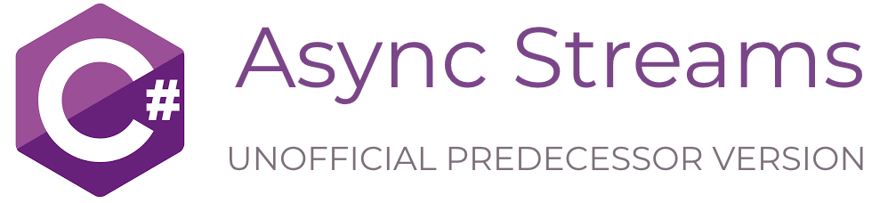

## SUMMARY

Makes asynchronous enumeration as easy as the synchronous counterpart. Such feature is also known as 'Async Streams' in upcoming C# 8.0. The library introduces familiar and easy to use syntax, `IAsyncEnumerable`, `IAsyncEnumerator`, `ForEachAsync()`, `ParallelForEachAsync()`, and other useful extension methods.


## PROBLEM SPACE

Helps to (a) create an element provider, where producing an element can take a lot of time due to dependency on other asynchronous events (e.g. wait handles, network streams), and (b) a consumer that processes those element as soon as they are ready without blocking the thread (the processing is scheduled on a worker thread instead). [Bassam Alugili made a great explanation on Async Streams in an InfoQ article](https://www.infoq.com/articles/Async-Streams).


## INSTALLATION

Visual Studio's [Package Manager Console](https://docs.microsoft.com/en-us/nuget/consume-packages/install-use-packages-powershell):
```powershell
Install-Package AsyncEnumerator -ProjectName MyProject
```

[NET Core CLI](https://docs.microsoft.com/en-us/dotnet/core/tools/?tabs=netcore2x):
```shell
dotnet add package AsyncEnumerator
```

Edit .csproj file:
```xml
<ItemGroup>
  <PackageReference Include="AsyncEnumerator" Version="3.1.0" />
</ItemGroup>
```


## EXAMPLE 1 (demonstrates usage only)

```csharp
    using Dasync.Collections;

    static IAsyncEnumerable<int> ProduceAsyncNumbers(int start, int end)
    {
      return new AsyncEnumerable<int>(async yield => {

        // Just to show that ReturnAsync can be used multiple times
        await yield.ReturnAsync(start);

        for (int number = start + 1; number <= end; number++)
          await yield.ReturnAsync(number);

        // You can break the enumeration loop with the following call:
        yield.Break();

        // This won't be executed due to the loop break above
        await yield.ReturnAsync(12345);
      });
    }

    // Just to compare with synchronous version of enumerator
    static IEnumerable<int> ProduceNumbers(int start, int end)
    {
      yield return start;

      for (int number = start + 1; number <= end; number++)
        yield return number;

      yield break;

      yield return 12345;
    }

    static async Task ConsumeNumbersAsync()
    {
      var asyncEnumerableCollection = ProduceAsyncNumbers(start: 1, end: 10);
      int count == 0;
      await asyncEnumerableCollection.ForEachAsync(async number => {
        await Console.Out.WriteLineAsync($"{number}");
        count++;
        if (count >= 5)
        {
          // You can break the ForEachAsync loop with the following call:
          ForEachAsync.Break();
        }
      });
    }

    // Just to compare with synchronous version of enumeration
    static void ConsumeNumbers()
    {
      var enumerableCollection = ProduceNumbers(start: 1, end: 10);
      foreach (var number in enumerableCollection) {
        Console.Out.WriteLine($"{number}");
      }
    }
```


## EXAMPLE 2 (LINQ-style extension methods)

```csharp
    using Dasync.Collections;
    
    IAsyncEnumerable<Bar> ConvertGoodFoosToBars(IAsyncEnumerable<Foo> items)
    {
        return items
          .Where(foo => foo.IsGood)
          .Select(foo => Bar.FromFoo(foo));
    }
```


## EXAMPLE 3 (async parallel for-each)

```csharp
    using Dasync.Collections;
    
    async Task<IReadOnlyCollection<string>> GetStringsAsync(IEnumerable<T> uris, HttpClient httpClient, CancellationToken cancellationToken)
    {
        var result = new ConcurrentBag<string>();
        
        await uris.ParallelForEachAsync(
            async uri =>
            {
                var str = await httpClient.GetStringAsync(uri, cancellationToken);
                result.Add(str);
            },
            maxDegreeOfParallelism: 5,
            cancellationToken: cancellationToken);
        
        return result;
    }
```


## [EXAMPLE 4 (Azure Cloud Table streaming)](https://gist.github.com/tyrotoxin/9f5ffb69cbcd9042f6f989104e4da0f6)


## [EXAMPLE 5 (Azure Cloud Queue streaming)](https://gist.github.com/tyrotoxin/c1f85a900bba9e5a4f2d570f67be2e37)


## WILL THIS MAKE MY APP FASTER?

No and Yes. Just making everything `async` makes your app tiny little bit slower because it adds overhead in form of state machines and tasks. However, this will help you to better utilize worker threads in the app because you don't need to block them anymore by waiting on the next element to be produced - i.e. this will make your app better in general when it has such multiple enumerations running in parallel. The best fit for `IAsyncEnumerable` is a case when you read elements from a network stream, like HTTP + XML (as shown above; SOAP), or a database client implementation where result of a query is a set or rows.


## DIFFERENCES BETWEEN C# 8.0 AND EARLIER VERSIONS
C# 8.0 and .NET Standard 2.1 introduce the native support for [Async Streams](https://docs.microsoft.com/en-us/dotnet/csharp/tutorials/generate-consume-asynchronous-stream). However, if you still use an older version of C# and wish to upgrade, the changes should be straight-forward.

Change an iterator from this:
```csharp
using Dasync.Collections;
IAsyncEnumerable<int> AsyncIterator() => new AsyncEnumerable(async yield =>
{
  await yield.ReturnAsync(123);
});
```
to this:
```csharp
using System.Collections.Generic;
async IAsyncEnumerable<int> AsyncIterator()
{
  yield return 123;
}
```

Change a consumer from this:
```csharp
using Dasync.Collections;
await asyncEnumerable.ForEachAsync(item => 
{
  ...
});
```
to this:
```csharp
using System.Collections.Generic;
await foreach (var item in asyncEnumerable)
{
  ...
}
```


## REFERENCES

GitHub: https://github.com/Dasync/AsyncEnumerable

NuGet.org: https://www.nuget.org/packages/AsyncEnumerator/

License: https://github.com/Dasync/AsyncEnumerable/blob/master/LICENSE


## IMPLEMENTATION DETAILS

__1: How to use this library?__

See examples above. The core code is in `System.Collections.Async` namespace. You can also find useful extension methods in `System.Collections` and `System.Collections.Generic` namespaces for `IEnumerable` and `IEnumerator` interfaces.


__2: Using CancellationToken__

```csharp
    IAsyncEnumerable<int> ProduceNumbers()
    {
      return new AsyncEnumerable<int>(async yield => {

        await FooAsync(yield.CancellationToken);
      });
    }
```

__3: Always remember about ConfigureAwait(false)__

To avoid performance degradation and possible dead-locks in ASP.NET or WPF applications (or any `SynchronizationContext`-dependent environment), you should always put `ConfigureAwait(false)` in your `await` statements:

```csharp
    IAsyncEnumerable<int> GetValues()
    {
      return new AsyncEnumerable<int>(async yield =>
      {
        await FooAsync().ConfigureAwait(false);

        // Yes, it's even needed for 'yield.ReturnAsync'
        await yield.ReturnAsync(123).ConfigureAwait(false);
      });
    }
```

__4: Clean-up on incomplete enumeration__

Imagine such situation:

```csharp
    IAsyncEnumerable<int> ReadValuesFromQueue()
    {
      return new AsyncEnumerable<int>(async yield =>
      {
        using (var queueClient = CreateQueueClient())
        {
          while (true)
          {
            var message = queueClient.DequeueMessageAsync();
            if (message == null)
              break;
            
            await yield.ReturnAsync(message.Value);
          }
        }
      });
    }

    Task<int> ReadFirstValueOrDefaultAsync()
    {
      return ReadValuesFromQueue().FirstOrDefaultAsync();
    }
```

The `FirstOrDefaultAsync` method will try to read first value from the `IAsyncEnumerator`, and then will just dispose it. However, disposing `AsyncEnumerator` does not mean that the `queueClient` in the lambda function will be disposed automatically as well, because async methods are just state machines which need somehow to go to a particular state to do the clean-up. To provide such behavior, when you dispose an `AsyncEnumerator` before you reach the end of enumeration, it will tell to resume your async lambda function (at `await yield.ReturnAsync()`) with the `AsyncEnumerationCanceledException` (derives from `OperationCanceledException`). Having such exception in your lambda method will break normal flow of enumeration and will go to terminal state of the underlying state machine, what will do the clean-up, i.e. dispose the `queueClient` in this case. You don't need (and shouldn't) catch that exception type, because it's handled internally by `AsyncEnumerator`. The same exception is thrown when you call `yield.Break()`.

There is another option to do the cleanup on `Dispose`:

```csharp
    IAsyncEnumerator<int> GetQueueEnumerator()
    {
      var queueClient = CreateQueueClient();

      return new AsyncEnumerable<int>(async yield =>
      {
        while (true)
        {
          var message = queueClient.DequeueMessageAsync();
          if (message == null)
            break;
            
          await yield.ReturnAsync(message.Value);
        }
      },
      onDispose: () => queueClient.Dispose());
    }
```

__5: Why is GetAsyncEnumeratorAsync async?__

The `IAsyncEnumerable.GetAsyncEnumeratorAsync()` method is async and returns a `Task<IAsyncEnumerator>`, where the current implementation of `AsyncEnumerable` always runs that method synchronously and just returns an instance of `AsyncEnumerator`. Having interfaces allows you to do your own implementation, where classes mentioned above are just helpers. The initial idea was to be able to support database-like scenarios, where `GetAsyncEnumeratorAsync()` executes a query first (what internally returns a pointer), and the `MoveNextAsync()` enumerates through rows (by using that pointer).

__6: Returning IAsyncEnumerable vs IAsyncEnumerator__

When you implement a method that returns an async-enumerable collection you have a choice to return either `IAsyncEnumerable` or `IAsyncEnumerator` - the constructors of the helper classes `AsyncEnumerable` and `AsyncEnumerator` are absolutely identical. Both interfaces have same set of useful extension methods, like `ForEachAsync`.

When you create an 'enumerable', you create a factory that produces 'enumerators', i.e. you can enumerate through a collection many times. On the other hand, creating an 'enumerator' is needed when you can through a collection only once.

Consider these 2 scenarios:

```csharp
    // You want to execute the same query against a database many times - you need an 'enumerable'
    IAsyncEnumerable<DbRow> GetItemsFromDatabase()
    {
      return new AsyncEnumerable<int>(async yield =>
      {
        using (var dbReader = DbContext.ExecuteQuery(...))
        {
          while (true)
          {
            DbRow row = dbReader.ReadAsync();
            if (row == null)
              break;
            await yield.ReturnAsync(row);
          }
        }
      });
    }

    // Assume that you cannot seek in the stream - you need an 'enumerator'
    IAsyncEnumerator<byte> EnumerateBytesInStream(Stream stream)
    {
      return new AsyncEnumerator<int>(async yield =>
      {
        while (true)
        {
          int byte = await stream.ReadByteAsync();
          if (byte < 0)
            break;
          await yield.ReturnAsync((byte)byte);
        }
      });
    }
```

__7: Where is Reset or ResetAsync?__

The `Reset` method must not be on the `IEnumerator` interface, and should be considered as deprecated. Create a new enumerator instead. This is the reason why the 'oneTimeUse' flag was removed in version 2 of this library.

__8: How can I do synchronous for-each enumeration through IAsyncEnumerable?__

You can use extension methods like `IAsyncEnumerable.ToEnumerable()` to use built-in `foreach` enumeration, BUT you should never do that! The general idea of this library is to avoid thread-blocking calls on worker threads, where converting an `IAsyncEnumerable` to `IEnumerable` will just defeat the whole purpose of this library. This is the reason why such synchronous extension methods are marked with `[Obsolete]` attribute.

__9: What's the difference between ForEachAsync and ParallelForEachAsync?__

The `ForEachAsync` allows you to go through a collection and perform an action on every single item in sequential manner. On the other hand, `ParallelForEachAsync` allows you to run the action on multiple items at the same time where the sequential order of completion is not guaranteed. For the latter, the degree of the parallelism is controlled by the `maxDegreeOfParallelism` argument, however it does not guarantee to spin up the exact amount of threads, because it depends on the [thread pool size](https://msdn.microsoft.com/en-us/library/system.threading.threadpool.setmaxthreads(v=vs.110).aspx) and its occupancy at a moment of time. Such parallel approach is much better than trying to create a task for an action for every single item on the collection and then awaiting on all of them with `Task.WhenAll`, because it adds less overhead to the runtime, better with memory usage, and helps with throttling-sensitive scenarios.


## RELEASE NOTES

3.1.0: Add support for NET Standard 2.1.
       Consolidate interface with Microsoft's implementation.

2.2.2: Bug-fix: IAsyncEnumerator.MoveNext must return False on Yield.Break instead of throwing OperationCanceledException.

2.2.0: New LINQ-style extension methods: SelectMany, Append, Prepend, OfType, Concat, Distinct, ToDictionaryAsync, ToLookupAsync, AggregateAsync.

2.1.1: Bug-fix: AsyncEnumerator.OnEnumerationComplete might throw a NullReferneceException when enumeration is canceled.
       Bug-fix: Batch extension method does not work at all - always throws InvalidOperationException.

2.1.0: New extension methods: Batch, UnionAll, Single, SingleOrDefault, DefaultIfEmpty, Cast.
       Bug-fix: AsyncEnumerator.MoveNextAsync() must not succeed after Dispose().

2.0.1: Bug-fix: call onDispose when AsyncEnumerator is GC'ed but enumeration hasn't been started.
       Bug-fix: re-throw base exception instead of AggregateException in blocking synchronous methods.

2.0.0: Revise design of the library: same features, but slight paradigm shift and interface breaking changes.

1.5.0: Add support for .NET Standard, minor improvements.

1.4.2: Add finalizer to AsyncEnumerator and call Dispose in ForEachAsync and ParallelForEachAsync extension methods.

1.4.0: Add new generic type AsyncEnumeratorWithState for performance optimization.
       Now IAsyncEnumerator&lt;T&gt; is covariant.
       Add ForEachAsync, ParallelForeachAsync, and LINQ-style extension methods for IAsyncEnumerator.

1.3.0: Significantly improve performance of AsyncEnumerator by reducing thread switching and re-using instances of TaskCompletionSource.
       Add support for a state object that can be passed into AsyncEnumerable and AsyncEnumerator for performance optimization.
       Remove CancellationToken from Select/Take/Skip/Where extension methods - fix improper implementation.
       Move AsyncEnumerationCanceledException out of the generic AsyncEnumerator type.
       Change default behavior of the ToAsyncEnumerable extension method - now MoveNextAsync will run synchronously by default.

1.2.3: AsyncEnumerationCanceledException is thrown to the async enumeration function when the AsyncEnumerator is disposed before reaching the end of enumeration, what allows to do the clean-up.
       Fixed MoveNextAsync() that threw an exception sometimes only when you passed the end of enumeration.

1.2.2: Fix exception propagation in AsyncEnumerator. 

1.2.1: New Linq-style extension methods in System.Collections.Async namespace.

1.2.0: Contract breaking changes in ParallelForEachAsync: introduce ParallelForEachException to unify error outcome of the loop.

1.1.0: Add ParallelForEachAsync extension methods for IEnumerable&lt;T&gt; and IAsyncEnumerable&lt;T&gt; in System.Collections.Async namespace.